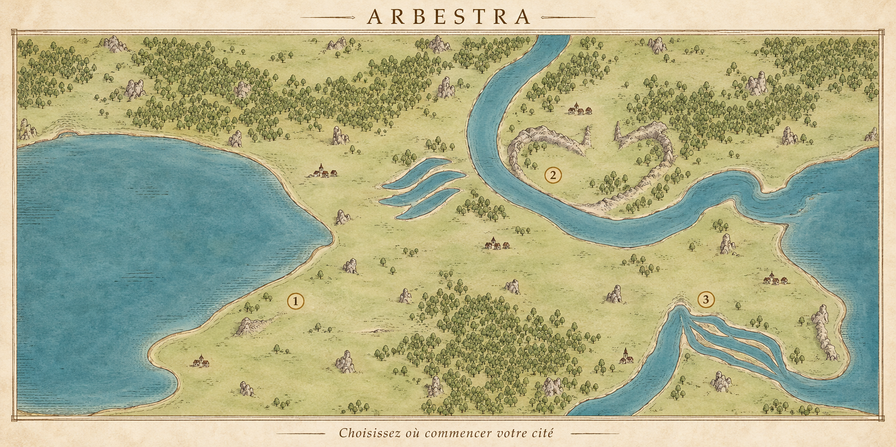

# Carte d'atlas RC1 — direction visuelle et textes éditables

10 octobre 2026. **Direction artistique validée ; atlas interactif recetté, installation jouable encore à raccorder.** Le dernier arbitrage conserve le choix libre du joueur avec un cercle de rayon 8, et remplace la piste des trois propositions. Nettoyage des seules emprises du kit à ±2 niveaux et territoires bloquants de rayon maximal 30 : règles consolidées dans la [spec RC1](SPEC-CARTE-SPAWN-RC1.md). L'état réellement livré est dans le [suivi atlas](IMPLEMENTATION-ATLAS-RC1.md).

## Référence validée

Image produite avec l'outil intégré imagegen, à partir d'une capture du terrain RC1. Parchemin clair, eau bleu délavé, contours à l'encre brune, relief hachuré, bosquets de symboles et petits bourgs. Les villages et repères numérotés de cette illustration sont des exemples de composition, pas des positions validées par le serveur. La reconstruction géographique part du JSON RC1 approuvé.

## Titre et slogan — validé

- Deux textes indépendants, dynamiques et éditables, fournis par la configuration de présentation.
- Le titre et le slogan sont rendus par l'interface, séparément du fond cartographique. Aucune inscription définitive dans l'image utilisée comme fond, dans les tuiles ou dans le décor.
- Modifier l'un de ces textes ne demande ni génération d'image ni reconstruction du terrain.
- `ARBESTRA` et `Choisissez où commencer votre cité` sont les valeurs illustrées par le concept, pas des chaînes figées dans le moteur de carte.
- Conserver une typographie d'atlas et une mise en page adaptée aux différentes longueurs de texte et aux petits écrans. Les textes restent sélectionnables et accessibles.

Convention d'implémentation : configuration persistante par monde, bouton « Modifier les textes » sur l'atlas pour les seuls opérateurs déjà autorisés par `WORLD_GENERATOR_OPERATOR_EMAILS`. Le serveur contrôle ce droit. Les joueurs lisent ces textes. L'image de référence sert à la direction artistique ; le fond SVG dérivé de la géographie ne contient aucun titre, slogan ni village intégré.

## Squelette de présentation

1. Fond décoratif : papier et cadre sobres.
2. Géographie préparée à partir du terrain réel : eau, relief et signes forestiers/rocheux.
3. Couche interactive indépendante : villages actuels, territoires tracés, cercle mobile et emplacement choisi, avec coordonnées du monde.
4. Interface : titre, slogan, survol nom/population, sélection et panneau d'emplacement.

La carte d'accueil vise un affichage 2D léger. La génération du fond et les données dynamiques sont séparées. Le concept ne remplace pas le champ géographique autoritaire et ne valide aucune nouvelle implantation.

## Prompt de la référence

Outil : imagegen intégré, avec `test-results/spawn-map-global.png` comme référence géographique et fond opaque. Prompt final :

> Use case: style-transfer / game-map visual direction. Create a polished old atlas style concept for the French city-building game Arbestra. Image 1 is a GEOGRAPHY REFERENCE: use only the rectangular world map inside the screenshot (approximately x=131..1308, y=216..806), discard all of the dark application UI, headings, buttons, margins and help text. Translate this exact 2:1 rectangular map into an elegant, highly readable hand-drawn atlas on light ivory parchment, seen perfectly flat, not a physical book, no perspective. Preserve the major geography from the reference: the large western bay, the eastern sea, the distinctive broad upper-right horseshoe water course coming down from the top edge and bending east, the branching narrow lower-right waterways, and the actual distribution of woodland masses and rocky ridges. Keep land and water topology and orientations as closely as possible; do not replace this with a generic fantasy island. This world continues beyond the straight map edges, so do not close all coastlines into an island. Artistic treatment: fine warm brown engraved outlines, faded blue-green watercolor water with sparse delicate coastal hatching, pale muted sage land washes, understated relief hachures and small contour marks, grouped tiny elegant tree glyphs following the woodland masses, modest rock glyphs where rock formations occur. Clear space between marks, restrained texture, very legible at a glance, inviting and sophisticated rather than grungy or dark. Small simple ink village glyphs indicate other players, no banners or name labels, no modern pin icons. Three discreet ochre outlined circular markers containing exactly '1', '2', '3' demonstrate proposed arrival locations on land, visually distinct from villages; these are compositional examples only. Put 'ARBESTRA' in a small refined serif title above the map and 'Choisissez où commencer votre cité' below it, with generous breathing room. A very fine simple atlas frame, no elaborate ornamental furniture, no fake roads, no monsters, no boats, no invented mountains, no giant castles, no dashboard, no cards, no red diagnostic grid, no computer UI, no photorealism, no 3D shading. High quality landscape concept image, with the wide 2:1 map occupying nearly all of the composition. Intended output is a visual reference for a later lightweight interactive 2D implementation, not an authoritative geographic asset.
