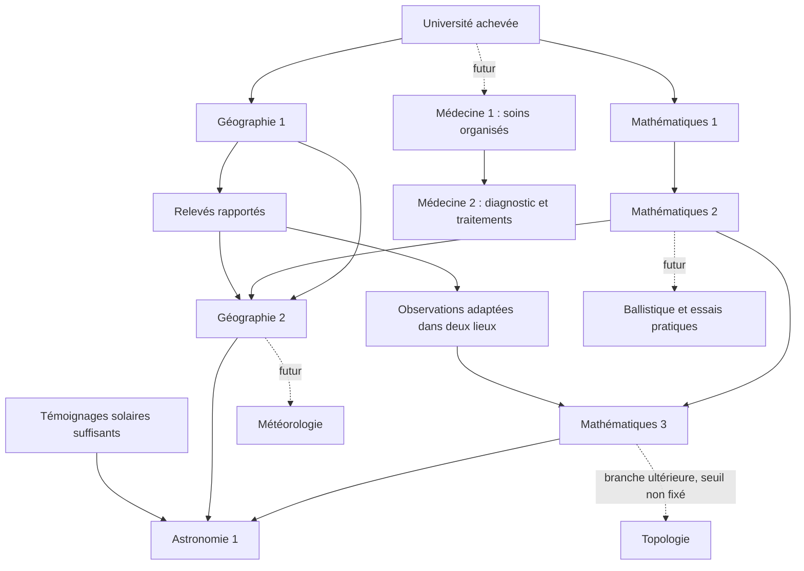

# Université, sciences et découverte du monde

Date : 3 octobre 2026. Base relue : `main`, `0a0873a`, avec un worktree comportant de nombreuses tranches non commitées.

Statut : **spécification fonctionnelle consolidée ; cadrage restant sur les paramètres et contrats de contenu indiqués en section 15**. Les arbitrages structurels ci-dessous sont validés. Ce document n'annonce aucune implémentation scientifique et n'autorise pas à coder.

## 1. Intention et périmètre

La civilisation construit progressivement une représentation intellectuelle d'un monde qui existe indépendamment d'elle. La recherche ouvre des actions, professions, informations, représentations et capacités de décision ; elle ne se réduit pas à des bonus de production.

Première tranche jouable validée : Université, Mathématiques 1–3, Géographie 1–2, formation des cartographes, relevés, exploration, Astronomie 1, carte et caméra conditionnées par la connaissance. L'Arbre des connaissances et l'adaptation de la cinématique de connexion/V font partie de ce parcours.

Extensions cadrées, sans réalisation dans cette tranche : Médecine, Météorologie, Ballistique, Topologie, espionnage et conséquences militaires/agricoles. L'intégration architecturale détaillée de l'Université à la building factory fera l'objet d'une passe visuelle dédiée ; ses principes sont fixés ici, pas ses dimensions ni ses recettes finales.

## 2. Existant vérifié et frontière de cette spec

Lecture ciblée, sans exécution ni validation navigateur :

- `apps/world-web/src/scene/BabylonVillageScene.ts` contient `startFlyover()`, le raccourci V et le raccourci C vers le regard du Chat. Ils constituent des points d'entrée à soumettre aux futures autorisations de représentation ; leur existence ne prouve aucun système de connaissance.
- Les modules de cosmologie, de caméra torique et de transitions existent. La recherche ne remplace pas cette simulation.
- `apps/world-web/src/scene/building-plan.ts`, notamment `recipeFor()`, résout actuellement des recettes hôtel/maison et leurs états de travaux ; aucune recette Université n'est déduite de cette lecture.
- La [spec factory](SPEC-FACTORY-BATIMENTS.md) porte les plans modulaires et états intermédiaires ; la [spec des vues](SPEC-VUES-TERRAIN-REGION-MONDE-TORIQUE.md) et la [spec cosmologique](SPEC-COSMOLOGIE-TORE-SOLEIL-CHAT.md) restent les références des représentations existantes. Le présent document définit leur futur conditionnement scientifique.

La spécification reste fonctionnelle : pas de schéma SQL, de nouveaux services ni de moteur orbital proposés ici. Les autorisations et acquis relèvent du serveur ; React présente les connaissances, Babylon les représente. Les cohortes qualifiées suffisent ; aucun PNJ individuel persistant n'est requis.

## 3. Réalité, connaissance et représentation

| Couche | Contenu | Règle |
|---|---|---|
| Réalité | Terrain, tore, soleil, occultations, ressources, météo, villages | Existe avant sa découverte et indépendamment de l'observation du joueur. |
| Connaissance | Témoignages, relevés, rapports datés, qualifications, modèles et paliers acquis | Les connaissances communes appartiennent au joueur dans un monde ; les qualifications appartiennent aux habitants formés. |
| Représentation | Carte, informations, zoom, arbre, cinématique | Ne révèle que ce qu'autorisent les acquis ; l'ignorance ne modifie pas le monde réel. |

Les villages d'un même joueur sur un même monde partagent les connaissances. Aucun transfert automatique entre mondes ou joueurs. Les moyens humains et universitaires restent locaux.

Une observation empirique peut précéder sa compréhension. Un habitant peut rapporter un village rencontré avant Géographie 2 ; ce palier ouvre l'exploration organisée de l'inconnu, pas l'existence des autres villages.

Astronomie 1 révèle la forme générale du monde, pas toute sa géographie. Une région inconnue reste indéterminée : ni côtes exactes, ni gisements, ni implantations dévoilés par une texture décorative, un survol ou un niveau de détail.

## 4. Université et capacité de travail

L'Université est un bâtiment réel et le point d'entrée du système scientifique. Sa construction achevée rend accessibles les premiers programmes de Mathématiques et de Géographie.

Deux progressions distinctes :

- **Niveau du bâtiment** : capacité matérielle, nombre de centres et effectifs mobilisables.
- **Niveau de discipline** : palier de maîtrise scientifique acquis pour le joueur/monde.

Un centre accueille une activité et son équipe : recherche ou formation. Plusieurs centres peuvent contribuer à un programme commun ou travailler sur des disciplines différentes. Formation et recherche partagent la capacité, sans double affectation d'un même centre ou habitant.

Le joueur choisit le programme et le plafond d'effectif simultané. Le travail est réel : disponibilité, énergie, repos et relève. Une qualification préalable de chercheur n'est pas requise pour ce premier noyau. L'effectif accélère le travail dans la limite propre au programme ; il ne remplace pas les observations manquantes.

Un seul programme actif par discipline et par joueur/monde. Des disciplines différentes peuvent progresser en parallèle. Plusieurs Universités peuvent contribuer au même programme avec leurs équipes locales, dans un plafond global ; elles ne produisent pas des copies concurrentes du même acquis.

Les valeurs de capacité, coûts et durées restent à équilibrer. Ne pas assimiler automatiquement un niveau métier à un étage ou à un niveau scientifique.

## 5. Départements, programmes et preuves

Un département organise une discipline. Son niveau exprime une capacité intellectuelle concrète. Les programmes explicites permettent de franchir ces paliers ; des connaissances empiriques peuvent être acquises en dehors de ces programmes.

Un programme comporte fonctionnellement : objectif, prérequis, travail à accomplir, plafond humain, observations/essais nécessaires, acquis et capacités résultantes. Les besoins d'observation peuvent émerger pendant la recherche et doivent alors être expliqués au joueur.

### Boucle de recherche validée

1. Étudier les informations disponibles.
2. Formuler un modèle ou une prédiction.
3. Faire apparaître un besoin d'observations empiriques.
4. Recueillir les mesures adéquates et confronter le modèle.
5. Acquérir le palier quand le travail et les preuves sont réunis.

Toutes les données ne sont pas exigées avant le début. Les observations et les essais sont conservés, réutilisables et non consommés. Les données antérieures sont recevables si elles contiennent effectivement les mesures requises. Une validation prédictive exige des mesures indépendantes de celles utilisées pour établir cette prédiction ; une ancienne visite n'est pas une preuve universelle.

Lorsque toute la théorie actuellement possible a été étudiée et que des observations manquent, le programme conserve son progrès et libère centres et habitants. À réception des données, il reprend automatiquement quand des moyens sont disponibles, dans le plafond choisi. Il ne préempte aucune activité. Une pause manuelle interdit la reprise automatique jusqu'à une commande de reprise.

L'exact ordonnancement de plusieurs reprises simultanées et les frais éventuels d'un programme spontané ne sont pas implicitement fixés par cette règle ; voir section 15.

## 6. Premier noyau de disciplines

| Palier | Maîtrise | Effet fonctionnel |
|---|---|---|
| Mathématiques 1 — Quantifier | Nombres, rapports, unités communes | Comparer distances, durées et relevés. |
| Mathématiques 2 — Mesurer l'espace | Géométrie, angles, triangulation | Assembler des relevés cohérents ; prérequis de Géographie 2 et de la future Ballistique. |
| Mathématiques 3 — Modéliser les cycles | Périodicité et relations entre mesures | Construire et confronter des modèles ; prérequis d'Astronomie. |
| Géographie 1 | Relevés ciblés et accès reconnus | Formation de cartographes ; exploitation distante sur un itinéraire reconnu. |
| Géographie 2 | Carte cohérente et exploration organisée | Expéditions vers l'inconnu, cartographie éloignée et découverte d'implantations. |
| Astronomie 1 | Modèle astronomique du monde torique | Représentation globale, nouveaux itinéraires compris et cinématique adaptée. |

Les niveaux d'une discipline sont successifs. Géographie 1 n'exige pas de palier mathématique : une connaissance pratique peut précéder la géométrie formalisée. Géographie 2 exige Géographie 1, Mathématiques 2 et des relevés effectivement rapportés.

**Mathématiques 3 nécessite des observations de deux lieux distincts.** Un lieu extérieur accessible via Géographie 1 suffit ; aucune expédition de Géographie 2 n'est obligatoire. La recherche précise les mesures attendues. Elle valide les outils de modélisation, sans déjà livrer le modèle torique réservé à Astronomie 1. Les seuils de durée/contraste entre lieux restent à fixer ; deux coordonnées arbitrairement voisines ne sont pas automatiquement une campagne pertinente.

Le graphe montre des conditions conjointes, pas des choix alternatifs. La Topologie n'a pas encore de seuil d'entrée fixé ; la flèche indique sa filiation mathématique.

## 7. Formation et missions des cartographes

Géographie 1 permet de former des habitants à l'Université, en mobilisant temps, centre et population. La qualification est durable. Entre missions, les cartographes peuvent exercer d'autres activités ; aucune double affectation. Géographie 2 étend les missions accessibles sans imposer de refaire la formation initiale.

### Missions

| Capacité | Destination | Résultat |
|---|---|---|
| Relevé ciblé — Géographie 1 | Lieu ou gisement déjà repéré empiriquement | Position relevée, observations demandées et accès reconnu. |
| Reconnaissance — Géographie 2 | Direction/secteur à explorer depuis le connu | Terrain, accès, ressources et implantations effectivement rencontrés. |

Les expéditions se définissent par **un objectif et un budget de temps**, pas uniquement par une surface à remplir. Les objectifs peuvent porter sur un relevé, un secteur ou la recherche d'une implantation. Le temps comprend déplacement, observation et retour ; le travail sur place et le transport restent distincts.

L'équipe réserve les moyens temporels et énergétiques de revenir. La règle opérationnelle proposée est un retour lorsque l'objectif est atteint ou qu'il faut repartir pour respecter ces moyens, avec résultats partiels si la progression est impossible. Le rappel anticipé et les interruptions doivent avoir un contrat précis avant leur implémentation ; aucun sauvetage, combat ou décès n'est inventé dans cette tranche.

Le cycle de référence est : former → affecter → partir physiquement → observer → revenir → intégrer les rapports au patrimoine commun. La représentation visuelle n'est jamais la preuve serveur d'un relevé. Le suivi en direct de l'expédition et l'instant exact de divulgation des observations doivent respecter le contrat de transmission à finaliser en section 15.

### Exploitation distante

Géographie 1 ouvre l'exploitation au-delà de la portée locale actuelle de huit cases : un gisement doit être repéré puis son accès reconnu. On ne remplace pas huit par un nouveau rayon arbitraire. Les limites opérationnelles dépendent de la route et des moyens, à préciser lors du raccordement aux chantiers.

La connaissance ne crée pas de passage à travers un obstacle, ne révèle pas le stock actuel d'un gisement éloigné et n'élargit pas le périmètre historique de construction du village. Les missions d'exploitation continuent d'appliquer leurs règles métier de disponibilité, transport, réservation et concurrence.

## 8. Carte, rapports et fraîcheur

| État | Connaissance disponible |
|---|---|
| Inconnu | Pas de rapport ; surface indéterminée. |
| Repéré | Témoignage, localisation approximative et caractéristiques réellement observées. |
| Relevé | Mesures cartographiques précises ; accès reconnu lorsque le trajet a été étudié. |

La connaissance précise ne signifie pas une surveillance permanente. Une implantation découverte est une observation datée ; ses changements ne sont pas transmis automatiquement. De futures missions d'espionnage permettront d'obtenir des informations fraîches. Une revisite peut enrichir les observations. Les champs exacts visibles sur un village étranger restent à définir, sans exposition implicite de sa population ou de ses stocks.

Les relevés de terrain et les rapports sur les entités évolutives ont des fraîcheurs distinctes. Une carte ancienne ne doit pas être effacée simplement parce qu'un village a changé, ni devenir une source de vérité économique actuelle.

## 9. Astronomie 1 : première campagne spontanée

Les habitants constatent les phénomènes solaires, en parlent aux chercheurs et suscitent une recherche d'explication. Les témoignages peuvent précéder Mathématiques 3 et Géographie 2.

Dès qu'une Université existe, les observations locales se constituent sans exiger que le joueur regarde le ciel ou reste connecté. Les contrastes rapportés pendant la session — éclairement très bref près du grand équateur, plusieurs cycles près du petit équateur — sont une motivation narrative et des indices, pas une table de valeurs à imposer à la simulation. Les données proviennent des phénomènes réellement calculés et identifient leur intervalle d'observation.

**Les observations locales peuvent suffire**, quelle que soit la région. Les expéditions peuvent compléter les preuves ; ni double lever obligatoire ni voyage obligatoire pour ce déclenchement. La durée et la définition de « témoignages suffisants » restent à calibrer explicitement.

Lorsque Mathématiques 3, Géographie 2 et les témoignages nécessaires sont réunis :

1. L'intention de recherche est signalée au joueur.
2. Le programme attend un centre libre et un habitant disponible.
3. Il démarre automatiquement avec un habitant, sans interrompre d'activité et sans clic obligatoire de lancement.
4. Le joueur peut renforcer l'effectif, le modifier ou mettre la recherche en pause.
5. La recherche suit la boucle normale de travail, modèle et validation ; le témoignage initial n'accorde pas immédiatement le palier.

Les habitants expriment une question sur leur ciel ; ils ne révèlent pas prématurément le tore. Aucune seconde campagne concurrente ne démarre dans une autre Université du joueur.

## 10. Effets d'Astronomie 1 : caméra et itinéraires

### Représentation

Avant le palier, le dézoom permet des indices de courbure et d'étrangeté mais pas une vue globale identifiant le tore entier. Le joueur peut soupçonner la vérité avant ses habitants. Après acquisition, la limitation est levée et la découverte peut se faire en manipulant librement le zoom, sans cinématique imposée.

Le changement ne recentre pas brutalement la caméra et ne modifie ni lieu, orientation locale ni phase cosmologique. La caméra reste attachée au lieu observé et suit la rotation du tore ; le soleil reste indépendant. Les transitions nuageuses, LOD et retours au même lieu doivent respecter les invariants des vues existantes.

Les mêmes règles couvrent molette, boutons, chargement initial, cinématique V et raccourcis comme C. Un éventuel contournement de développement doit être explicite et absent du parcours joueur normal. La position exacte de la limite pré-Astronomie se règlera en recette ; elle ne doit pas dépendre d'une simple dissimulation par les nuages contournable par la rotation.

### Navigation

La topologie physique ne change pas. Les itinéraires empiriquement parcourus restent utilisables avant la compréhension globale ; aucune frontière artificielle n'est créée à la couture des coordonnées.

Astronomie 1 permet de replacer les relevés dans le modèle global et de considérer plusieurs itinéraires autour du monde. Les meilleurs itinéraires **déjà reconnus et praticables** sont employés automatiquement aux prochains départs. Un passage suggéré à travers l'inconnu nécessite d'abord reconnaissance ; le pathfinding ne lit pas le terrain secret pour accorder un raccourci.

Les missions engagées conservent leur trajet et leurs échéances. Les gains portent sur le transport, pas le travail. La recherche n'impose ni ligne droite ni absence de détour.

## 11. Arbre des connaissances et cinématique

### Arbre des connaissances

Vue accessible depuis l'Université, commune aux connaissances du joueur/monde :

- un nœud par palier, groupé par discipline ;
- liens de prérequis explicites pour les nœuds révélés ;
- acquis, recherches accessibles et prochains prolongements révélés progressivement ;
- détail du programme, moyens engagés, preuves disponibles/manquantes et missions associées ;
- contributions des différentes Universités, avec affectation des moyens locaux depuis le bâtiment ouvert.

États lisibles : inaccessible, disponible, en recherche, en attente d'observations, en attente de moyens, en pause, acquis. Ne pas exposer le contenu d'un nœud lointain par infobulle, lien, monument fantôme ou texte caché. Avant Astronomie 1, une formulation telle que « Comprendre les cycles célestes » préserve la découverte ; après, le modèle et ses effets peuvent être expliqués.

### Coefficient de connaissance du monde

**Validé : coefficient propre au joueur/monde, dérivé des acquis**, et non nouvelle monnaie ou jauge à remplir séparément. Les seuils scientifiques commandent les grandes révélations ; la cartographie connue enrichit le parcours. La formule numérique et les seuils secondaires ne sont pas encore fixés.

| Profil autorisé | Cinématique de connexion / V |
|---|---|
| Connaissance locale | Approche depuis les environs connus, arrivée au village. |
| Connaissance régionale | Survol des territoires cartographiés, transition nuageuse puis village. |
| Astronomie 1 acquise | Départ autour du tore, approche de la région puis arrivée au village. |

Accumuler des relevés ne permet jamais de contourner Astronomie 1 pour voir le tore entier. Après ce palier, les zones inconnues restent indéterminées pendant le survol. En l'absence d'un parcours régional suffisamment connu, utiliser le profil local autorisé plutôt que révéler du terrain réel. Ce repli est une prescription de cohérence, pas un nouveau palier.

## 12. Architecture visible et monuments

Direction validée pour la future passe factory : véritable composition architecturale autour d'une cour, avec silhouettes conçues par niveau plutôt qu'empilement de blocs. Les agrandissements rendent lisibles les centres/effectifs supplémentaires. La cour et les circulations doivent rester cohérentes avec l'entrée, l'emprise et les états de travaux existants de la factory.

Chaque transition prise en charge prévoit un état intermédiaire de travaux, conformément à la spec factory. Les dimensions, nombre de niveaux, capacités et recettes exactes ne sont pas encore validés.

Les grands paliers scientifiques, notamment Mathématiques 3 et Astronomie 1, débloquent des monuments commémoratifs **dans toutes les Universités du joueur sur ce monde**, y compris futures. Le niveau du bâtiment exprime sa capacité ; les monuments expriment les acquis communs.

Prévoir des emplacements intégrés à la composition et préservés lors des agrandissements. Le placement automatique ou personnalisable, le coût éventuel et les modèles sont ouverts. Géomètre pour Maths 3 et anneau pour Astronomie 1 sont des pistes visuelles, pas des recettes approuvées. Un monument non débloqué ne doit pas divulguer la découverte.

## 13. Extensions prévues

### Médecine — point de départ validé, révisable après usage

Le département est accessible dès l'Université, sans prérequis en Mathématiques ou Géographie. Ses premières recherches reposent sur l'observation et la pratique ; des outils de mesure pourront intervenir ultérieurement, sans dépendance supplémentaire fixée ici.

L'Université porte recherche et formation dans ses centres existants ; une aile médicale dédiée matérialisera ensuite le développement du département. Sa construction n'est pas un prérequis aux premières études. Une **infirmerie distincte** accueille les patients et les soignants ; les observations issues des soins peuvent alimenter la recherche. L'aile relève de la future composition factory, sans nouvelle organisation universitaire parallèle.

| Palier | Formation débloquée | Capacité |
|---|---|---|
| Médecine 1 — Soins organisés | Infirmier·ère | Soins courants, suivi des patients et accompagnement de la récupération. |
| Médecine 2 — Diagnostic et traitements | Médecin | Diagnostic, choix du traitement et interventions complexes, avec accès également aux soins courants. |

Les formations sont **distinctes** : aucune formation infirmière préalable n'est obligatoire pour devenir médecin. Médecine 2 prolonge le palier scientifique Médecine 1, pas une carrière infirmière individuelle. Les observations des soins nourrissent cette progression ; leur contenu exact reste à définir.

Une infirmerie peut fonctionner avec des infirmier·ères seuls pour les soins courants. Les cas complexes exigent un médecin. Les médecins peuvent également assurer les soins courants ; les deux professions sont complémentaires, sans binôme obligatoire pour chaque soin.

Chaque qualification peut recevoir un **agrément militaire indépendant** :

| Profession et agrément | Affectation à l'infirmerie | Accompagnement des troupes au combat |
|---|---|---|
| Infirmier·ère civil·e | Autorisée | Interdit |
| Infirmier·ère militaire | Autorisée | Autorisé |
| Médecin civil·e | Autorisée | Interdit |
| Médecin militaire | Autorisée | Autorisé |

L'agrément ouvre une affectation, sans remplacer la qualification médicale ni réserver la personne à l'armée. Être autorisé n'implique pas un départ automatique. Les conditions d'obtention et les autres conséquences de l'agrément seront décrites plus tard.

Restent ouverts pour la tranche médicale future : coûts et durées de formation, capacités de l'infirmerie, besoins de soins et distinction concrète courant/complexe, preuves des programmes, recettes architecturales, modalités de reconversion. Aucun système de blessures, maladies, épidémies, mortalité ou combat n'est implicitement ajouté. La Médecine demeure hors de la première implémentation jusqu'à Astronomie 1.

### Autres disciplines et prolongements

- **Météorologie :** département accessible à Géographie 2. Observations empiriques locales possibles dès le début ; premier palier futur centré sur l'organisation des relevés, pas des prévisions immédiates. Mathématiques pour les modèles ultérieurs ; Astronomie/Topologie pour les circulations globales plus tard. Aucun nouveau simulateur atmosphérique ni effet agricole dans cette tranche.
- **Ballistique :** accessible après Mathématiques 2 ; essais pratiques nécessaires au premier palier futur. Applications militaires ultérieures. Le vent physique et sa connaissance restent distincts : la météorologie permettra d'anticiper et corriger le tir. Caserne/stand obligatoire, essais exacts et capacités militaires restent non arbitrés.
- **Topologie :** branche ultérieure des Mathématiques. Observer une forme étrange, construire un modèle astronomique du tore et comprendre ses propriétés topologiques sont des étapes distinctes. Aucun palier exact ni nouvel arbre lointain imposé.
- **Espionnage :** future actualisation d'informations sur des villages ; aucun système d'espionnage ou de combat créé ici.

## 14. Persistance et transitions fonctionnelles

Persistance nécessaire : acquis scientifiques du joueur/monde, observations et leur provenance/date/lieu, relevés et accès reconnus, rapports datés d'implantations, programmes/progrès/besoins de preuves/pauses, contributions locales, formations et qualifications, objectifs/équipes/parcours/rapports d'expédition. Les déblocages de monuments et les profils de présentation se déduisent des acquis ; pas de nouvelle progression indépendante implicite.

Un rechargement ou une déconnexion n'efface ni données ni travail et ne relance pas un programme spontané déjà engagé. Les échéances reposent sur le temps serveur. Le fonctionnement hors connexion ne dépend pas de Babylon ou de la fréquence des snapshots. L'application doit préserver les invariants transactionnels existants sans choisir dans cette spec une nouvelle architecture d'ordonnancement.

| Transition | Résultat attendu |
|---|---|
| Prérequis atteints | Programme accessible, ou campagne spontanée en attente de moyens. |
| Centre et habitants affectés | Travail effectif, pas de double affectation. |
| Besoin empirique découvert | Demande compréhensible, observations possibles en parallèle. |
| Travail possible épuisé, preuves manquantes | Progrès conservé, moyens libérés. |
| Preuves reçues | Reprise automatique sans préemption, sauf pause manuelle. |
| Pause manuelle | Aucun redémarrage automatique ; acquis/progrès conservés. |
| Travail et preuves complets | Palier acquis une seule fois, capacités communes actualisées. |
| Expédition revenue | Rapports conservés et intégrés selon leur contenu réel. |

Proposition de continuité à confirmer avant prise en charge de destruction/conquête : conserver les acquis malgré la perte d'une Université ; seule la capacité disponible disparaît. Aucune règle de conquête/transfert de qualifications n'est définie ici.

## 15. Points ouverts et borne de préparation à l'implémentation

Ne pas présenter ces valeurs ou règles comme déjà arbitrées :

1. **Équilibrage :** coûts/durées de construction, formation/recherche/relevés, centres et effectifs par niveau, plafonds de programmes, effectifs d'expédition. Préparer un petit tableau pour arbitrage, pas des valeurs cachées dans le code.
2. **Contrats de preuve :** contenu mesuré par programme, durée suffisante des observations solaires, pertinence des deux lieux de Maths 3 et conditions de validation reproductibles. Une observation locale doit rester suffisante pour déclencher Astronomie partout. Définir l'intervalle utilisé avant de parler de nombre de cycles ou de pourcentage éclairé.
3. **Programmes :** découpage minimal des programmes par palier et éventuelles dépenses automatiques d'Astronomie 1. Aucun prélèvement matériel non arbitré ne découle du seul démarrage avec un habitant.
4. **Missions :** transmission seulement au retour recommandée ; informations de suivi visibles pendant le voyage, rappel, interruption, taille d'équipe et limites opérationnelles des trajets distants à préciser. Ne pas créer implicitement combat/perte d'équipes.
5. **Capacité :** ordre équitable des reprises concurrentes, sens d'une pause lorsqu'un programme reçoit plusieurs contributions, devenir des affectations lors d'une indisponibilité du bâtiment. La non-préemption et la pause manuelle prioritaire sont déjà fixées.
6. **Présentation :** seuils du coefficient, profil régional exact, réglage du zoom pré-Astronomie et schéma minimal des informations publiques d'une implantation. Concevoir sans divulguer la surface inconnue.
7. **Factory :** emprise/recettes/niveaux de l'Université et placement des monuments. Passe architecturale dédiée ; les acquis ne justifient pas des dimensions improvisées.
8. **Comptes de développement/existants :** politique d'initialisation des connaissances et éventuel bypass de recette ; ne pas transformer l'ancien accès visuel au monde en progrès scientifique arbitraire.

Ces points n'annulent pas les arbitrages structurels ; ils empêchent de déclarer toute la tranche immédiatement prête à coder sans compléter son contenu minimal. Les extensions militaires, météorologiques et topologiques n'ont pas à être détaillées pour lever ces points.

## 16. Critères d'acceptation fonctionnels

1. Deux villages du même joueur/monde partagent un palier ; un autre joueur ou monde ne l'acquiert pas.
2. Un niveau de bâtiment accroît sa capacité sans accorder un niveau scientifique, et réciproquement.
3. Une activité ne dépasse pas les centres/effectifs autorisés et ne double pas un habitant affecté ailleurs.
4. Recherche et formation utilisent la même capacité ; plusieurs Universités contribuent sans dupliquer l'acquis.
5. Une recherche commence avec des preuves incomplètes, peut demander des mesures nouvelles et ne termine pas sans elles.
6. L'attente de données conserve le progrès et libère les moyens ; leur retour ne préempte rien et ne lève pas une pause manuelle.
7. Mathématiques 3 peut être validé avec des observations adéquates de deux lieux accessibles avant Géographie 2, sans déjà révéler le tore.
8. Géographie 2 exige Mathématiques 2, Géographie 1 et des relevés rapportés ; la formation existante reste valable.
9. Un gisement distant ne devient exploitable qu'avec la capacité scientifique et l'accès reconnu ; la constructibilité n'est pas élargie.
10. Une expédition respecte objectif, budget et retour ; un rapport partiel ne cartographie pas des lieux non visités.
11. Un village découvert reste un rapport daté, sans mise à jour omnisciente de ses données changeantes.
12. Astronomie 1 démarre spontanément une seule fois après ses conditions, avec un centre libre et un habitant disponible ; une région à régime solaire simple n'est pas bloquée.
13. Déconnexion/reconnexion préserve travail, observations et pauses ; aucune progression ne dépend des figurants ou du rendu du ciel.
14. Avant Astronomie 1, aucune entrée normale — V/C compris — ne révèle le tore entier ; des indices restent perceptibles.
15. Après Astronomie 1, le dézoom global est libre sans cinématique forcée ; les zones non relevées restent indéterminées.
16. L'acquisition ne provoque ni saut de lieu/orientation/phase lumineuse, ni modification rétroactive de mission ; les futurs départs utilisent les meilleurs accès connus.
17. L'Arbre des connaissances est progressivement révélé et ne divulgue pas le tore via ses textes, liens ou monuments verrouillés.
18. Le coefficient dérivé adapte connexion/V ; beaucoup de cartographie ne remplace jamais le seuil Astronomie 1.
19. Les monuments des grands acquis sont disponibles dans toutes les Universités, anciennes et nouvelles, du bon joueur/monde.
20. La passe architecturale respecte emprise, entrée, cour, composition par niveau et état intermédiaire de travaux, sans mêler statue et capacité de recherche.

## 17. Suite bornée

Compléter les contrats minimaux de contenu et l'équilibrage avec Tristan, puis implémenter le socle par parcours : capacité/recherche → formation/relevés → exploration/connaissance → Astronomie/caméra/arbre/cinématique. La passe visuelle Université se prépare sur la factory existante. Ce séquencement ne constitue pas une autorisation de coder.

Vérification de cette session : relecture documentaire et cohérence des décisions, aucune exécution applicative ni campagne E2E. Les critères ci-dessus sont des critères futurs, pas des résultats de tests.
